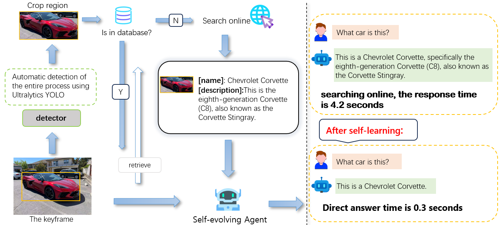

## Self-evolving Agent: A framework for autonomous evolving AR interaction based on context confidence

### [Paper](https://arxiv.org) | [Project Page](https://hoar012.github.io/RAP-Project/) | [Model](https://huggingface.co/Hoar012/RAP-LLaVA-13b) | [Data](https://github.com/Hoar012/Rap-MLLM/blob/main/data/Data.md)

|  |
|:--:|
| The difference between the time it takes for a self-evolving agent to reply  |

Visit our [Project Page](https://github.io/RAP-Project/) for more demostrations.

## 📋 Contents

自进化”智能体：YOLO 感知 → 向量记忆 → 知识图谱 → LoRA 增量学习

## 一键安装（Linux / macOS）
```
git clone https://github.com/yourname/Self-evolving-Agent.git
cd Self-evolving-Agent

自动创建 venv、安装依赖、下载权重、启动 Neo4j
bash scripts/run.sh
```
## DEMO
```
from yolo_concept import ConceptLearner

agent = ConceptLearner(
    yolo_weights="yolo_concept_sdk/yolo_concept/data/weights/yolov8n.pt",
    neo4j_uri="bolt://localhost:7687",
    neo4j_auth=("neo4j", "password")
)
# 单张图像增量学习
agent.learn_from_image("desk.jpg", concepts=["keyboard", "mouse"])

# 查询已学概念
print(agent.query_concept("keyboard"))
# → {'definition': 'electronic device ...', 'images': [...], 'relations': [{'type': 'PartOf', 'target': 'desk'}]}

# 用自然语言生成 LoRA 提示
prompt = agent.generate_prompt("A cat sitting on a keyboard under RGB lighting")
print(prompt)
```
浏览器打开 http://localhost:8000/docs 可看交互式 API。

## 自主训练（增量 LoRA）
```
# 把 20 张新概念图片放文件夹
agent.continual_lora_train(
    image_dir="new_concept/rgb_keyboard",
    concept="rgb_keyboard",
    epochs=5,
    output_dir="lora_weights/rgb_keyboard"
)
# 权重自动保存，下次加载自动融合
```
## 离线评估
```
cd eval
python eval.py \
  --weights ../yolo_concept_sdk/yolo_concept/data/weights/yolov8n.pt \
  --gt data/ground_truth.json \
  --topk 5
```

## BibTeX

```
@InProceedings{

}
```


